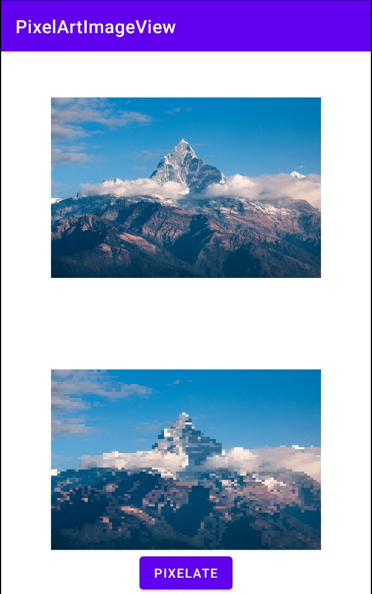

# PixelArtImageView

[](https://jitpack.io/#Josh-Owen/PixelArtImageView)

PixelArtImageView is a lightweight library used to convert standalone images into pixel art. 
The view extends [ImageView](https://developer.android.com/reference/android/widget/ImageView) 
behaviour and can therefore use any of it's properties. 
The library also implements callbacks allowing for you intercept events such as once an 
image has begun being converted to pixel art and upon completion in addition to providing some alternative configuration options.



Samples: Canvas Width x 88 & Canvas Height x 88

## Getting started

### Download

For detailed instructions please check out the
official [Jitpack documentation](https://jitpack.io/#Josh-Owen/PixelArtImageView/tag).

Additionally you can download the project from the
Github's [release's page](https://github.com/Josh-Owen/PixelArtImageView/releases).

Or use Gradle:

```
allprojects {
    repositories {
        maven { url "https://jitpack.io" }
    }
}

dependencies {
    implementation 'com.github.Josh-Owen:PixelArtImageView:1.1.0'
}
```

Or Maven:

```
<repositories>
    <repository>
        <id>jitpack.io</id>
        <url>https://jitpack.io</url>
    </repository>
</repositories>

<dependency>
    <groupId>com.github.Josh-Owen</groupId>
    <artifactId>PixelArtImageView</artifactId>
    <version>1.1.0</version>
</dependency>
```

### Usage

The library makes use of a builder pattern and a simple usage of this library in Kotlin with:

```
ivPixelatedImage
    .load(R.drawable.yourdrawable)
    .setGridHeight(gridHeight)
    .setGridWidth(gridWidth)
    .onStart {  // Show your progress bar here  }
    .onFinished {  // Hide your progress bar here }
    .build()
```

Or alternatively it can be initialised in XML:

```
<com.joshowen.pixelart_imageview.PixelArtImageView
    android:id="@+id/pixelArtImageView"
    android:layout_width="wrap_content"
    android:layout_height="wrap_content"
    app:gridWidth="88"
    app:gridHeight="88"
    app:enableAutomaticallyPixelate="true"
    app:srcCompat="@drawable/yourdrawable" />
```

Note: The XML approach will not show a progress bar and by default the image will show an empty
ImageView unless you execute the following code in your activity or fragment.

```
binding.pixelArtImageView.build()
```

The library also implements a custom interface [ImagePixelationListener](https://github.com/Josh-Owen/PixelArtImageView/blob/main/pixelart_imageview/src/main/java/com/joshowen/pixelart_imageview/ImagePixelationListener.kt)
which implements the following functions:

```
    fun onStart() (Optional)
    fun onFinished() (Mandatory)
```

This listener can be applied in the following way or alternatively implemented as an
interface in your activity or view:

```
ivPixelatedImage
    .load(R.drawable.yourdrawable)
    .setGridHeight(gridHeight)
    .setGridWidth(gridWidth)
    .addPixelationListener(object : ImagePixelationListener {
    override fun onStart() {

    }

    override fun onFinished() {

    }
})
.build()
```

If you would like the original image to be displayed temporarily before being converted to a 
pixelated image the following properties can be applied:

In Kotlin in your builder:

``` 
.setOriginalImageHiddenByDefault(false)
```

Or in XML:

```
app:originalImageHiddenByDefault="false"
```


Note: There are code samples demonstrating the usage of all of which in the demo project.

And that is all folks! I am open to suggestions in how to further improve this library to increase
it's utility.

Be kind & help others. Cya!